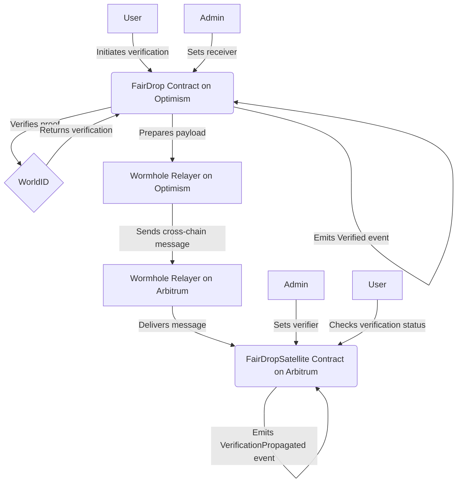

# Usage

- [WorldID Orb](https://worldcoin.org/world-id)
- [Wormhole](https://docs.wormhole.com/wormhole/quick-start/tutorials/hello-wormhole/hello-wormhole-explained)

You can power-up your smart contract to only serve WorldID Orb verified users
by calling the `isVerified` function of the FairDrop contract on the network of
your choice.

## Mainnet Addresses:

- Optimism: `0x04a85361c22eD1DDF4f3EcB998570FC71A5df991`
- Arbitrum: `0x146174BD95fB5b71Dd6aa6dd003d52D0bC4dA799` (Satellite)

## Testnet Addresses:

Coming soon:)

## Code Example

The `IFairDrop` interface is tiny, it has one function that is relevant:

```solidity
interface IFairDrop {
    function isVerified(address _user) external view returns (bool);
}
```

after defining the interface, you can use it in your smart contract like this:

```solidity
modifier onlyVerified() {
    require(IFairDrop(fairDropAddress).isVerified(msg.sender), "FairDrop: User is not verified");
    _;
}
```

and then

```solidity
function antiSybilFunction() public onlyVerified {
    // only humans allowed here!
}
```

## How it works

There is a Satellite contract on Arbitrum that receives data from Optimism core
FairDrop contract through Wormhole

Satellite cannot perform verification, it is only a mirror of the data in the
core contract

This graphs encapsulates the flow from the higher-level:


